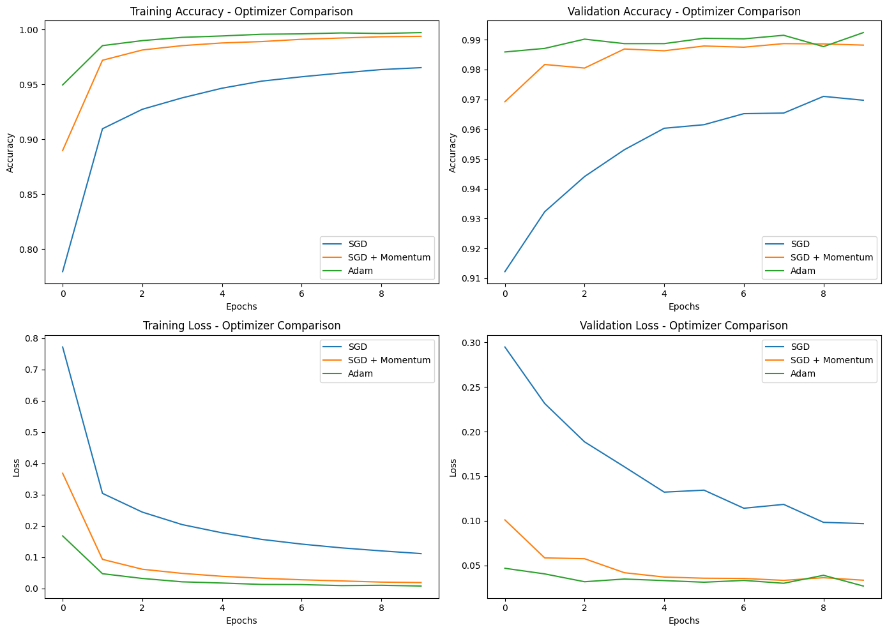
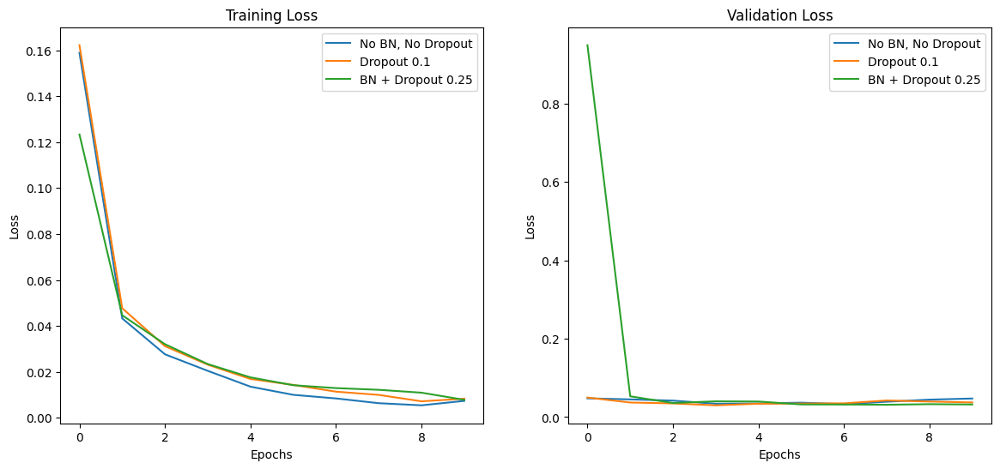

# Handwritten Digit Classification using CNN and MLP (MNIST)

## Objective
The objective of this assignment is to analyze the effect of **activation functions**, **optimizers**, and **regularization techniques** on the performance of neural networks for handwritten digit classification using the MNIST dataset.

A Convolutional Neural Network (CNN) is trained under different configurations, and the models are compared using accuracy and loss curves.

---

## Dataset
- **Dataset:** MNIST
- **Image Size:** 28 × 28 (grayscale)
- **Classes:** 10 (digits 0–9)
- **Training Samples:** 60,000
- **Testing Samples:** 10,000

---

## Task 1: Activation Function Comparison

### Activation Functions Tested
- Sigmoid
- Tanh
- ReLU

### Final Validation Accuracy

| Activation Function | Validation Accuracy |
|--------------------|---------------------|
| Sigmoid | 0.1135 |
| Tanh | 0.9645 |
| ReLU | 0.9735 |

### Observations
- Sigmoid performs extremely poorly due to the vanishing gradient problem.
- Tanh significantly improves performance by providing stronger gradients.
- ReLU achieves the best accuracy and fastest convergence.

### Plots

---

## Task 2: Optimizer Showdown

*(Activation function fixed to ReLU)*

### Optimizers Tested
- SGD
- SGD with Momentum
- Adam

### Final Validation Accuracy

| Optimizer | Validation Accuracy |
|----------|---------------------|
| SGD | 0.9697 |
| SGD + Momentum | 0.9882 |
| Adam | 0.9924 |

### Observations
- SGD converges slowly and shows more fluctuations.
- Momentum improves convergence speed and stability.
- Adam converges the fastest and achieves the highest accuracy.

### Plots

---

## Task 3: Batch Normalization and Dropout

### Configurations Tested
1. **No Batch Normalization, No Dropout**
2. **No Batch Normalization, Dropout = 0.1**
3. **Batch Normalization + Dropout = 0.25**

### Final Validation Accuracy

| Configuration | Validation Accuracy |
|--------------|---------------------|
| No BN, No Dropout | 0.9874 |
| Dropout = 0.1 | 0.9893 |
| BN + Dropout = 0.25 | 0.9910 |

### Observations
- The model without regularization shows slight overfitting.
- Adding Dropout improves generalization by reducing overfitting.
- Combining Batch Normalization with Dropout provides the most stable training and best validation accuracy.

### Plots

---

## Conclusion
- ReLU is the most effective activation function for CNNs.
- Adam optimizer provides the fastest convergence and highest accuracy.
- Dropout reduces overfitting, while Batch Normalization stabilizes training.
- The combination of Batch Normalization and Dropout achieves the best generalization performance.
- Proper selection of activation functions, optimizers, and regularization techniques significantly improves CNN performance.