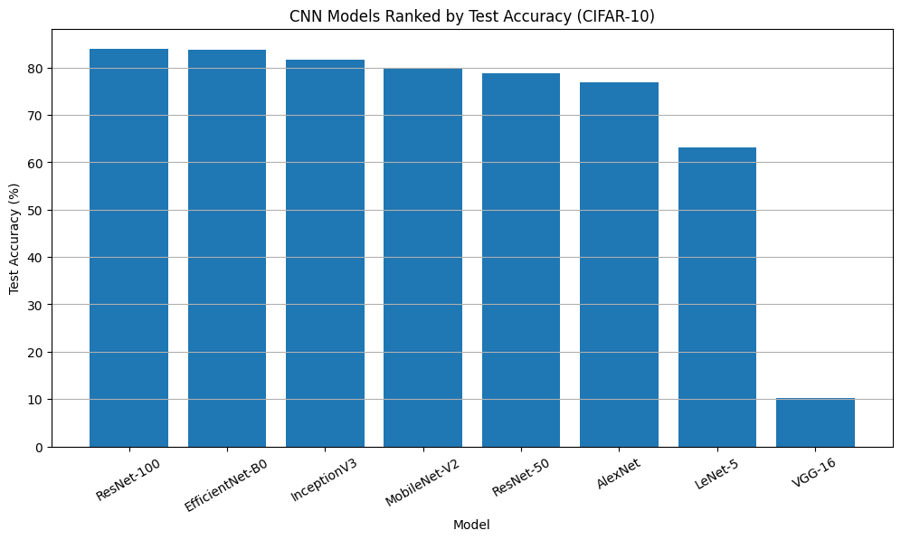
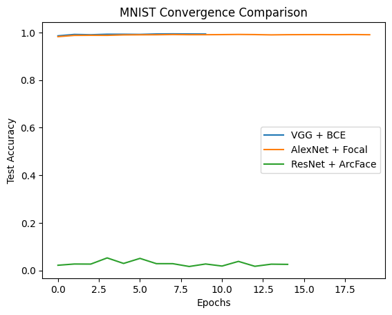
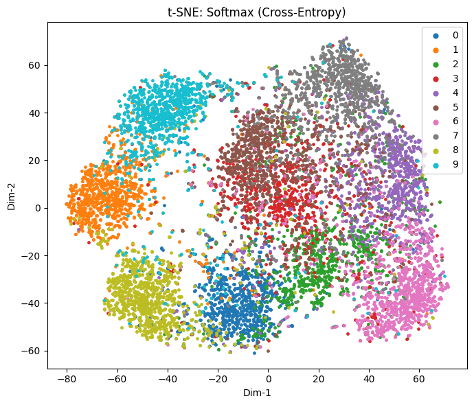
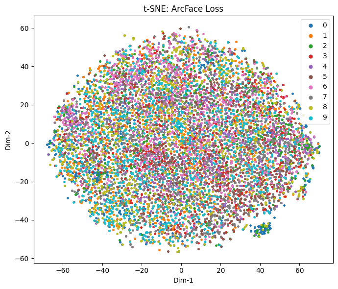

# Comparative Study of CNN Architectures, Loss Functions, and Optimization Strategies

## Project Overview
This project presents a comparative analysis of **CNN architectures, loss functions, and optimization strategies** to understand their impact on classification performance, convergence behavior, and feature representation quality.

All experiments are implemented using **PyTorch** and executed on **Google Colab with GPU support**.

---

## Datasets Used

- **CIFAR-10**  
  32×32 RGB images across 10 classes. Used for analyzing architectural depth and feature representations.

- **MNIST**  
  28×28 grayscale handwritten digits. Used for studying loss functions and convergence behavior.

---

## Part 1: CNN Architecture Comparison (CIFAR-10)

### Objective
To evaluate how **network depth and architectural complexity** affect model performance on a complex dataset.

### Architectures Implemented
- LeNet-5
- AlexNet
- VGGNet
- ResNet-50 / ResNet-100
- EfficientNet
- InceptionV3
- MobileNet

### Evaluation Metrics
- Training and testing accuracy
- Convergence behavior
- Depth vs performance trade-offs

---

## Part 2: Loss Function and Optimizer Analysis (MNIST)

### Objective
To study how different **loss functions and optimizers** influence convergence speed and accuracy.

| Model    | Optimizer | Epochs | Loss Function |
|---------|----------|--------|---------------|
| VGGNet  | Adam     | 10     | BCE |
| AlexNet | SGD      | 20     | Focal Loss |
| ResNet  | Adam     | 15     | ArcFace Loss |

---

## Results and Visualizations

### Part 1 Results: CNN Architecture Comparison on CIFAR-10
The following figure compares the classification accuracy of different CNN architectures on the CIFAR-10 dataset, highlighting the impact of network depth and architectural design.

---

### Part 2 Results: Loss Function Convergence on MNIST
The following figure illustrates the convergence behavior of different loss functions and optimization strategies on the MNIST dataset.

## Part 3: Feature Space Visualization (CIFAR-10)

### Objective
To visually analyze how different loss functions influence the **learned feature embeddings**, beyond accuracy metrics.

### Method
- Identical CNN backbone
- Feature embeddings extracted from test set
- t-SNE used for 2D visualization
- Comparison between **Softmax** and **ArcFace** loss

### Results

**Softmax Loss Visualization**

**ArcFace Loss Visualization**

### Observation
Softmax loss produces overlapping and diffuse clusters, whereas ArcFace loss yields **compact and well-separated feature clusters**, highlighting the benefit of margin-based supervision.

---

## How to Run
1. Open the notebooks in Google Colab
2. Enable GPU runtime
3. Run all cells sequentially

---

## Conclusion
This study shows that while deep architectures improve performance on complex datasets, **loss function choice plays a critical role in feature quality**.  
Margin-based losses such as ArcFace significantly enhance feature separability, which is essential for recognition and retrieval tasks.

---
